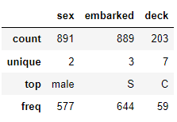
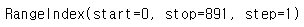
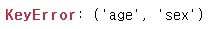

# **Udemy Pandas 강의**

 
 
 

## **Section 3. 판다스 기초**

 
 

### **판다스 화면 표시 옵션**

 

- 데이터프레임이 60개보다 적은 수의 행을 가지고 있다면 Pandas는 기본적으로 모든 행을 보여줌
- 60개 이상의 행을 가진다면 min_rows 설정이 우선하여 10개 행이 표시됨

- 처음 10개 행과 마지막 10개 행으로 총 20개의 행이 보고싶다면 min_rows 설정을 20으로 변경

 

    pd.options.display.max_rows
    pd.options.display.min_rows

 

- 옵션 설정을 통해서 보여지는 행을 변경할 수 있음
- 아래 코드를 통해 보여지는 행을 891개로 변경 가능

 

    pd.options.display.max_rows = 891

 
 

### **데이터 점검**

 

- info()를 통해 데이터프레임의 많은 정보를 얻을 수 있음
- 또한 결측치 등 잠재적인 문제를 식별 가능함

 

    titanic.info()

 

- 숫자열에 대한 요약통계 확인

 

    titanic.describe()

 

- include = "O"하면 자료형이 객체인 열을 선택 가능
- 결과값의 unique는 실제 고유값의 개수이고, top은 최빈값을 의미함

 

    titanic.describe(include = "O")

 
 

### **Pandas 내장함수, 속성 및 메소드**

 

- 데이터프레임 크기 확인

 

    titanic.shape

 

- 행 데이터 * 열 데이터

 

    titanic.size

 

- RangeIndex 확인하기
- 0부터 891까지 1칸 간격으로 인덱스가 있음을 확인

 

    titanic.index

 

- 데이터프레임의 모든 칼럼 보기

 

    titanic.columns

 

- method chaining
- 메소드들을 차례로 연결시켜서 결과를 볼 수 있음

 

    titanic.mean().sort_values().head(2)

 

### **열 선택하기**

 

#### **대괄호 [ ]를 이용한 열 선택**

 

- series 형태로 출력
- series는 한 개의 열 또는 한 개의 행만 보여줌
- 1차원 배열임

 

    titanic["age"]

 

- 두 개 이상의 열을 선택 시 아래와 같은 코드로 진행하면 오류가 발생함
- 오류 메시지를 확인하면 튜플로 된 열의 레이블이 없다는 뜻

 

    titanic["age", "sex"]

 

- 두 개 이상의 열을 선택할 때는 열 레이블을 리스트로 입력해줘야 함

 

    titanic[["age", "sex"]]

 

- 한 개의 열만 선택할 때도 리스트 처리 후 출력 가능함
- 그렇다면 한 개의 열을 출력할 때 Series가 좋은가? list가 좋은가?
- 답은 정해진 것이 없음. 대부분의 메소드를 서로 공유하기 때문임

 

#### **점 표기법을 이용한 한 개의 열 선택**

 

    titanic.age

 

- 한 개의 열을 선택할 때는 점 표기나 [ ] 표기나 결과가 동일함
- 아래의 equals()를 통해 확인해 볼 수 있고 결과가 True라면 동일하다는 의미

 

    titanic.age.equals(titanic["age"])
    
  
  
 ### **Indexing**
  
  
  
- 시작지점은 인덱스가 0
- 순차적으로 숫자부여
- 음수 인덱싱은 마지막이 -1, 앞으로 갈수록 -2, -3 ...
   
 

#### **위치기반 인덱싱**

 

- 범위인덱스로 되어 있는 것을 데이터프레임의 각각 열을 인덱스로 설정해줄 수 있음
- index_col = "컬럼 이름" 해주게 되면 인덱스가 컬럼 기반으로 변경된 것 확인할 수 있음

 

    summer = pd.read_csv("summer.csv", index_col = "Athlete")

    summer.iloc[0]
    summer.iloc[1:4]
    summer.iloc[:, 4]

 

### **레이블 기반 인덱싱**

 

- 데이터의 양이 많을 경우, 우리는 행의 위치 인덱스를 정확히 모름
- 이럴 때 레이블 기반 인덱스 사용
- 위치 기반 인덱스는 iloc, 레이블 기반 인덱스는 loc 사용

 

    summer.loc["DRIVAS, Dimitrios"]
    
 

- 위에서 인덱스를 운동선수 이름으로 변경하였고, 운동선수가 메달을 획득한 횟수가 많을 경우, 여러 행이 출력될 수 있음
- 위치 기반 인덱스와 달리, 레이블 기반 인덱싱을 하게 되면 특정 레이블에 대한 모든 값을 가져옴

 

    summer.loc["PHELPS, Michael", ["Medal", "Event"]]

 

- iloc를 사용하면 : 기준으로 왼쪽은 포함, 오른쪽은 미포함
- loc를 사용하면 : 기준으로 왼쪽, 오른쪽 모두 포함

 

    summer.loc[:"CHASAPIS, Spiridon"]

 

- 위에서 펠프스를 기준으로 인덱싱했을 때 여러 행이 출력된 것을 확인할 수 있었음
- loc를 통해 슬라이싱 연산할 때, 펠프스는 인덱스 상에서 중복되기 때문에 오류 발생
- 중복되는 인덱스에 대해서는 슬라이싱 연산 불가

 

    summer.loc[:"PHELPS, Micheal"]

 

- 고유한 이름을 가진 인덱스끼린 슬라이싱 가능

 

    summer.loc["DRIVAS, Dimitrios":"BLAKE, Arthur", "City":"Discipline"]

 

### **reindex**

 

- reindex는 datetime 날짜시간 인덱스가 있는 시계열 데이터를 작업할 때 주로 사용
- 데이터프레임에 존재하지 않는 행 또는 열 레이블을 reindex()에 전달할 수도 있음

 

- 데이터 개수는 총 31165인데 인덱스에 40000을 입력하여 오류 발생

 

    summer.loc[[0,5,30000,40000], ["Athlete", "Medal"]]

 

- reindex를 통해 인덱스가 40000인 행을 하나 더 추가
- 값은 NaN으로 채워짐

 

    summer.reindex(index = [0,5,30000,40000], columns = ["Athlete", "Medal"])

 

- reindex를 이용한 슬라이싱에서는 중복되는 인덱스 사용 시 오류
- reindex에서는 index, columns 모두 리스트 형태로 넣어줘야 함(하나의 변수만 넣는다하더라도)

 

    summer.reindex(index = ["PHELPS, Michael"], columns = ["Medal", "Age"])