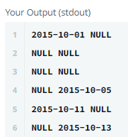

## **SQL Project Planning**

 
 

### **문제**

 

- 완료된 프로젝트의 총 개수를 찾아 Start_Date, End_Date 출력하기
- End_Date와 Start_Date의 차이는 테이블의 각 행에 대해 1일
- End_Date가 Start_Date로 이어지면 동일한 프로젝트라는 의미
- 프로젝트를 완료하는 데 걸린 일 수를 오름차순으로 정렬
- 완료 일수가 동일한 프로젝트가 둘 이상 있는 경우 프로젝트의 시작 날짜를 기준으로 오름차순

 

#### **오답 문제풀이**

 

- 프로젝트를 완료하는데 하루 걸린 기간을 구하는 쿼리

 

    SELECT Start_Date
        , End_Date
    FROM Projects
    WHERE End_Date NOT IN (SELECT Start_Date FROM Projects)

 

- 프로젝트를 연속적으로 진행할 경우의 시작 날짜와 완료 날짜 구하는 쿼리

 

    SELECT CASE WHEN Start_Date NOT IN (SELECT End_Date FROM Projects) THEN Start_Date END AS s_date
        , CASE WHEN End_Date NOT IN (SELECT Start_Date FROM Projects) THEN End_Date END AS e_date
    FROM Projects

 

 

- 프로젝트가 연속적일 경우 위 결과와 같이 시작 날짜와 완료 날짜 컬럼을 바로 옆으로 붙이는 방법을 찾지 못했고 프로젝트 중간 날짜도 제외하는 방법을 찾지 못했다.
- 결국 해당 문제는 구글링을 통해 풀게 되었다

 

#### **정답 문제풀이**

 

- End_Date와 Start_Date가 연속적이지 않은 Start/End_Date를 각각 뽑아주고 Start_Date가 End_Date보다 작은 것을 기준으로 Join해줌
- 그냥 조인을 해주면 시작 날짜와 완료 날짜가 모든 경우의 수를 보여주게 됨
- Start_Date로 그룹핑 후 그 중 End_Date가 가장 작은 값이 실제 프로젝트 완료날짜
- 프로젝트 기간으로 오름차순 정렬
- 프로젝트 기간이 이틀 이상일 경우 프로젝트 시작일자로 정렬

 

    SELECT Start_Date, MIN(End_Date)
    FROM (
        SELECT Start_Date 
        FROM Projects 
        WHERE Start_Date NOT IN (SELECT End_Date FROM Projects)
        ) p1,
        (
        SELECT End_Date
        FROM Projects
        WHERE End_Date NOT IN (SELECT Start_Date FROM Projects)
        ) p2
    WHERE Start_Date < End_Date
    GROUP BY Start_Date
    ORDER BY DATEDIFF(MIN(End_Date), Start_Date), Start_Date