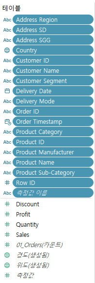
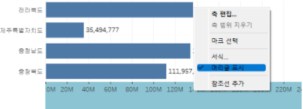
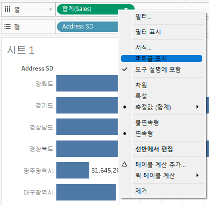
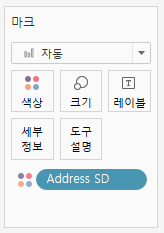

# Tableau

 
 
 

## **데이터 시각화가 필요한 이유**

 

- 우리가 포커스하고 싶은 정보에 강조를 함으로써 보고싶은 정보에 집중할 수 있음
- 방대한 양의 데이터 패턴을 지도 한 장으로 표현할 수 있음
- 분포가 모두 같다고 나오는 데이터셋들을 시각화를 통해 실제 분포를 확인해 볼 수 있음

- 시각화 이후 단계는 없음
- 따라서 프로젝트에 대해 잘 모르는 사람들과 소통하고 설득하기 위해 시각화를 효율적으로 활용할 수 있음

 
 
 

## **태블로 구성**

 

**태블로 프렙**

- 데이터 준비과정에서 사용. 데이터를 조인, 클렌징 등 분석에 필요한 데이터를 취합하는 용도로 사용

**태블로 데스크탑**

- 차트 등을 이용해 대시보드를 구성하여 시각화 작업을 진행. 화면을 만드는 도구

**태블로 리더**

- 워크북(대시보드)을 읽을 수 있는 도구. 편집 불가능

**태블로 퍼블릭**

- 외부의 오픈된 곳에 올린 대시보드에 제약없이 누구나 접근 가능

**태블로 서버/온라인**

- 접근 제약이 있음. 사내에서 사용

 

### **태블로 데스크탑 프로 VS 퍼블릭**

 

**프로**

- 로컬PC에 작업물 저장 가능
- 태블로 서버를 포함한 다양한 데이터베이스 지원

**퍼블릭**

- 로컬PC에 저장이 되지 않음
- 오픈된 웹상에 저장을 해야 하기 때문에 기업 입장에서 손해가 있음
- 웹 서버 데이터는 접속 불가

 
 
 

## **태블로 VS 엑셀**

 

**태블로**

- 데이터를 시각적으로 표현하는 도구
- 데이터를 빠르고 정확하게 탐색하는 것이 주 목적이라면 태블로가 좀 더 나은 툴

**엑셀**

- 데이터 원본으로서의 역할
- 스프레드시트로서 다양한 기능 제공

 

### **데이터 표현 방식**

 

**태블로**

- 그래프 중심

**엑셀**

- 테이블 형식

 

### **데이터 편집 방식**

 

**태블로**

- 데이터를 시각화하는 도구
- 주어진 원본 데이터가 따로 있다는 의미
- 원본 데이터를 태블로로 가져오면 데이터 원본 편집 불가

**엑셀**

- 데이터 원본 역할을 함
- 따라서 원본 편집 가능

 

### **데이터 계산 방식**

 

**태블로**

- 측정값을 집계해서 보여줌 (엑셀의 피봇테이블과 유사)
- SUM/AVG/MIN/MAX 등

**엑셀**

- 측정값을 있는 그대로 보여줌
- 데이터를 한줄한줄 각각 보여줌

 
 
 

## **태블로 사용법**

 

- 왼쪽 상단의 Excel을 눌러 파일 업로드 가능
- 업로드한 csv 파일의 시트를 오른쪽으로 드래그해 사용 가능
- 우측 상단의 필터를 사용해 데이터 옵션 선택 가능
- 왼쪽 하단의 시트1을 누르고 변경된 창에서 시각화 작업 시작

 

- 태블로에서 모든 데이터는 집계되어 사용됨
- 먼저 덩어리를 크게 보고 점점 자르고 쪼개어 drill down하는 것이 태블로의 역할

 

- Discount를 기준으로 위는 차원, 아래는 측정값이라고 불림

 

- 테이블의 각 컬럼을 행, 열, 마크에 drag-and-drop으로 넣어 차트 표현이 가능함
- 차트의 범례를 없애고 싶을 땐, 범례 우클릭 - 머리글 표시를 클릭하여 해제 가능

 

- 범례를 다시 만들고 싶다면 상단의 합계 - 우클릭 - 머리글 표시 클릭하여 생성 가능

 

- 그래프의 색상을 변경하고 싶다면 기준 컬럼을 마크의 색상에 drag-and-drop 해주면 됨
 

 